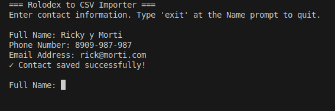

# **Práctica 1: Importador CLI de Rolodex a CSV**

## **🎯 El Proyecto**

Desarrollar una aplicación de línea de comandos (CLI) en **Java** capaz de rescatar los contactos de un viejo [Rolodex](https://ca.wikipedia.org/wiki/Rolodex) físico y digitalizarlos en un práctico archivo CSV.

## **📋 Contexto del Proyecto**

En la era digital, muchas empresas y profesionales aún conservan información valiosa en formatos analógicos. Tu misión es crear una herramienta que permita la transición de estos datos al mundo digital de manera eficiente y segura.

## **✨ Requisitos Clave**

### **1. Interfaz Interactiva**

La aplicación debe guiar al usuario a través de la consola para introducir los contactos uno por uno de forma intuitiva y clara.

### **2. Datos a Capturar**

Por cada contacto, el sistema debe solicitar:

- **Nombre completo**
- **Número de teléfono**
- **Dirección de email**

### **3. Gestión Automática del CSV**

- Creará y gestionará automáticamente el archivo CSV
- Asegurará la inclusión de encabezados correctos: `Nombre,Telefono,Email`
- Validará la estructura del archivo antes de cada escritura

### **4. Bucle continuo**

La aplicación debe funcionar en un **bucle continuo**, permitiendo al usuario añadir múltiples contactos en una sola sesión sin necesidad de reiniciar el programa.

### **5. Manejo Robusto de Datos**

- Gestión correcta del "escapado" de caracteres especiales (ej. comas en un nombre)
- Validación de formato de email (opcionalmente)
- Normalización de números de teléfono (opcionalmente)
- Mantenimiento de la integridad del archivo CSV

## **🔧 Requisitos Técnicos**

### **Obligatorios**

- **Lenguaje:** Java (versión 7 o superior)
- **Paradigma:** Programación estructurada ("sin POO" entrecomillas)

### **Formato del Archivo CSV**

```csv
Nombre,Telefono,Email
Victor Frankenstein,5557762323,doctor@nodedojo.com
Jane Smith,555-123-4567,jane.smith@example.com
"Doe, John Jr.",555-999-8888,john.doe@test.com
```

### **Estructura de Directorios Sugerida**

```
rolodex-cli/
├── RolodexImporter.java    # Archivo principal del programa
├── writable/
│   └── contacts.csv         # Archivo CSV generado
└── README.md                # Documentación
```

# Diagrama de flujo

```
┌─────────────────────────────────────────────────────────────────┐
│                        START APPLICATION                         │
└────────────────────────────┬────────────────────────────────────┘
                             │
                             ▼
                  ┌──────────────────────┐
                  │ Initialize CSV File  │
                  │  - Check if exists   │
                  │  - Create directory  │
                  │  - Add header if new │
                  └──────────┬───────────┘
                             │
                             ▼
                  ┌──────────────────────┐
                  │  Display Welcome     │
                  │  Message & Help      │
                  └──────────┬───────────┘
                             │
                             ▼
              ┌──────────────────────────────┐
              │   ╔═══════════════════════╗  │
              │   ║   MAIN INPUT LOOP     ║  │
              │   ╚═══════════════════════╝  │
              │                              │
              │   Prompt: "Full Name:"       │
              └──────────────┬───────────────┘
                             │
                             ▼
                    ┌────────────────┐
                    │  Read Name     │
                    └────────┬───────┘
                             │
                ┌────────────┴────────────┐
                │                         │
                ▼                         ▼
        ┌──────────────┐         ┌──────────────┐
        │ Name = 'exit'│         │ Name is empty│
        │   or NULL?   │         │   or blank?  │
        └───────┬──────┘         └──────┬───────┘
                │                       │
            YES │                   YES │
                ▼                       ▼
        ┌──────────────┐         ┌──────────────┐
        │ Display Exit │         │ Show Error & │
        │   Message    │         │   Continue   │
        └───────┬──────┘         └──────┬───────┘
                │                       │
                ▼                       │
        ┌──────────────┐               │
        │     EXIT     │               │
        └──────────────┘               │
                                       │
                NO                     │
                │                      │
                ▼                      │
        ┌──────────────┐              │
        │ Prompt:      │              │
        │"Phone Number"│              │
        └───────┬──────┘              │
                │                     │
                ▼                     │
        ┌──────────────┐             │
        │ Read Phone   │             │
        └───────┬──────┘             │
                │                    │
                ▼                    │
        ┌──────────────┐            │
        │ Prompt:      │            │
        │"Email Address│            │
        └───────┬──────┘            │
                │                   │
                ▼                   │
        ┌──────────────┐           │
        │  Read Email  │           │
        └───────┬──────┘           │
                │                  │
                ▼                  │
        ┌──────────────┐          │
        │ Escape CSV   │          │
        │   Fields     │          │
        │ (if needed)  │          │
        └───────┬──────┘          │
                │                 │
                ▼                 │
        ┌──────────────┐         │
        │ Append Row   │         │
        │   to CSV     │         │
        └───────┬──────┘         │
                │                │
                ▼                │
        ┌──────────────┐        │
        │ Show Success │        │
        │   Message    │        │
        └───────┬──────┘        │
                │               │
                └───────────────┘
                        │
                        └──────► LOOP BACK TO "Prompt: Full Name"

```

## **💡 Métodos del Proyecto**

Los métodos que deben tenerse al final del desarrollo:

- **main(String[] args)** - Método principal que ejecuta la aplicación, maneja el bucle de entrada de contactos y la interacción con el usuario
- **initializeCsvFile()** - Método que inicializa el archivo CSV con el encabezado si no existe o está vacío
- **appendToCSV(String name, String phone, String email)** - Método que añade un registro de contacto al archivo CSV
- **escapeCsvField(String field)** - Método que "escapa" los campos CSV que contienen caracteres especiales (comas, comillas, saltos de línea)

## **🚀 Ejemplo de Ejecución**



## **💡 Consejos y Buenas Prácticas**

1. **Testing:** Prueba casos extremos (nombres con comas, emails inválidos, etc.)
2. **Mensajes Claros:** Proporciona feedback constante al usuario sobre el estado de las operaciones
3. **Manejo de Excepciones:** Captura y gestiona adecuadamente errores de I/O
4. **Código Modular:** Aunque no uses POO, organiza tu código en funciones/métodos reutilizables

## **🎓 Recursos Adicionales**

- [Documentación de java.io](https://docs.oracle.com/javase/8/docs/api/java/io/package-summary.html)
- [Guía de BufferedReader y BufferedWriter](https://docs.oracle.com/javase/tutorial/essential/io/)

---
